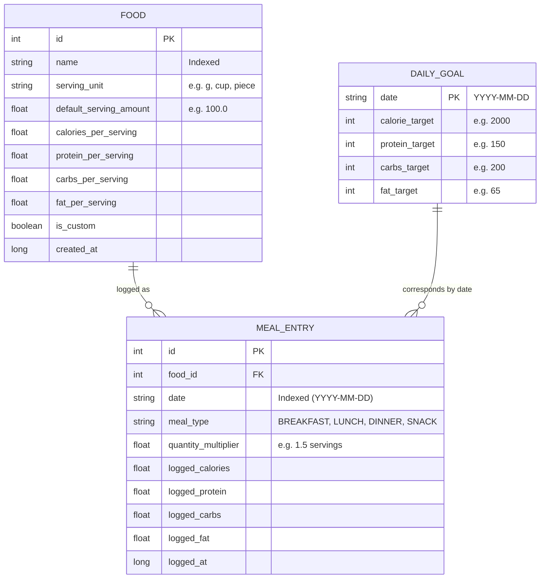

# CalorieTrack — Local Database Schema & Calculations

This document details the SQLite database design implemented using **Android Room**. The schema is optimized for fast offline search, low disk usage, relational integrity, and effortless scaling.

---

## 1. Entity-Relationship Diagram (ERD)

---

## 2. Table Specifications

### Table 1: `foods` (The Food Catalogue)
Stores both built-in reference foods and user-created custom foods.

| Column Name | SQLite Type | Room / Kotlin Type | Nullable | Description |
| :--- | :--- | :--- | :---: | :--- |
| `id` | `INTEGER` | `Long` | No | Primary Key (`autoGenerate = true`). |
| `name` | `TEXT` | `String` | No | Name of the food (e.g., `"Oatmeal"`, `"Chicken Breast"`). Indexed for fast search. |
| `serving_unit` | `TEXT` | `String` | No | Description of the serving (e.g., `"g"`, `"oz"`, `"cup"`, `"egg"`). |
| `serving_amount` | `REAL` | `Double` | No | Base quantity per serving (e.g., `100.0` for 100g, `1.0` for 1 egg). |
| `calories` | `REAL` | `Double` | No | Calories (kcal) contained in the base serving. |
| `protein` | `REAL` | `Double` | No | Protein in grams per base serving. |
| `carbs` | `REAL` | `Double` | No | Carbohydrates in grams per base serving. |
| `fat` | `REAL` | `Double` | No | Fat in grams per base serving. |
| `is_custom` | `INTEGER` | `Boolean` | No | `0` = Built-in reference food; `1` = User-created custom food. |
| `created_at` | `INTEGER` | `Long` | No | Timestamp (milliseconds) when added. |

* **Indexes**:
  - Index on `name` (`CREATE INDEX idx_food_name ON foods(name);`) ensures typing in the search bar responds in milliseconds even with thousands of rows.

---

### Table 2: `meal_entries` (Daily Food Log)
Represents a specific food eaten at a specific meal on a specific date.

| Column Name | SQLite Type | Room / Kotlin Type | Nullable | Description |
| :--- | :--- | :--- | :---: | :--- |
| `id` | `INTEGER` | `Long` | No | Primary Key (`autoGenerate = true`). |
| `food_id` | `INTEGER` | `Long` | No | Foreign Key pointing to `foods.id`. |
| `food_name` | `TEXT` | `String` | No | Cached snapshot of the food name at time of logging. |
| `date` | `TEXT` | `String` | No | ISO-8601 Date (`"YYYY-MM-DD"`). Indexed for instant daily summary queries. |
| `meal_type` | `TEXT` | `String` | No | Enum value: `"BREAKFAST"`, `"LUNCH"`, `"DINNER"`, `"SNACK"`. |
| `serving_quantity`| `REAL` | `Double` | No | Multiplier of the base serving entered by user (e.g., `1.5`). |
| `serving_unit` | `TEXT` | `String` | No | Snapshot of the serving unit (e.g., `"grams"`). |
| `logged_calories`| `REAL` | `Double` | No | Calculated calories stored at log time. |
| `logged_protein` | `REAL` | `Double` | No | Calculated protein (g) stored at log time. |
| `logged_carbs` | `REAL` | `Double` | No | Calculated carbs (g) stored at log time. |
| `logged_fat` | `REAL` | `Double` | No | Calculated fat (g) stored at log time. |
| `logged_at` | `INTEGER` | `Long` | No | Timestamp of logging (used to sort entries within a meal). |

* **Foreign Key**:
  - `foreignKeys = [ForeignKey(entity = FoodEntity::class, parentColumns = ["id"], childColumns = ["food_id"], onDelete = ForeignKey.CASCADE)]`
* **Indexes**:
  - Index on `date` (`CREATE INDEX idx_meal_date ON meal_entries(date);`) guarantees daily dashboards load in one read operation.

#### Explicit Meal Representation in V1
The `meal_type` column stores standardized lowercase string values representing the meal category:
- `breakfast`
- `lunch`
- `dinner`
- `snack`

#### Why a Separate `meals` Table is Intentionally Unnecessary for V1:
1. **Zero JOIN Overhead**: Querying today's breakfast or lunch executes as a direct, single-table filter (`SELECT * FROM meal_entries WHERE date = :date AND meal_type = 'breakfast'`). This avoids relational JOIN complexity and reduces memory allocation.
2. **Fixed Business Logic**: In V1, meal categories are standard universal buckets rather than dynamic user-defined entities.
3. **Simpler Maintenance**: A single table model is easier to debug, test, and backup without cascade sync issues.

---

### Table 3: `daily_goals` (User Nutrition Goals)
Allows users to set a default goal that applies to every day, or optionally record historical goals when their dietary targets change over time.

| Column Name | SQLite Type | Room / Kotlin Type | Nullable | Description |
| :--- | :--- | :--- | :---: | :--- |
| `date` | `TEXT` | `String` | No | Primary Key: `"YYYY-MM-DD"` or special value `"DEFAULT"`. |
| `calorie_target` | `INTEGER` | `Int` | No | Daily calorie target (e.g., `2000`). |
| `protein_target` | `INTEGER` | `Int` | Yes | Optional daily protein target in grams (e.g., `150`). |
| `carbs_target` | `INTEGER` | `Int` | Yes | Optional daily carbs target in grams (e.g., `200`). |
| `fat_target` | `INTEGER` | `Int` | Yes | Optional daily fat target in grams (e.g., `65`). |

---

## 3. Mathematical Formula for Nutrition Calculations

When a user selects a food and adjusts the serving, the application calculates and stores the logged totals using standard proportional scaling:

$$\text{Logged Calories} = \text{Base Food Calories} \times \text{Serving Quantity}$$

$$\text{Logged Protein} = \text{Base Food Protein} \times \text{Serving Quantity}$$

$$\text{Logged Carbs} = \text{Base Food Carbs} \times \text{Serving Quantity}$$

$$\text{Logged Fat} = \text{Base Food Fat} \times \text{Serving Quantity}$$

### Concrete Example:
- **Food**: Rolled Oats
  - Base Serving: 40g = 150 kcal | 5g Protein | 27g Carbs | 2.5g Fat
- **User logs**: 1.5 servings (60g)
  - Logged Calories = $150 \times 1.5 = 225\text{ kcal}$
  - Logged Protein = $5 \times 1.5 = 7.5\text{ g}$
  - Logged Carbs = $27 \times 1.5 = 40.5\text{ g}$
  - Logged Fat = $2.5 \times 1.5 = 3.75\text{ g}$

### Why Values Are Stored in `meal_entries`:
We store the calculated values directly in `meal_entries` (called **denormalization**).
* **Benefit**: If the user later edits a custom food or if reference nutrition data updates, past historical meal logs are **not altered retroactively**. Your historical record remains permanently true to what you ate that day.
* **Performance**: Daily summary queries simply execute `SELECT SUM(logged_calories) FROM meal_entries WHERE date = :today`, which runs in microseconds.
