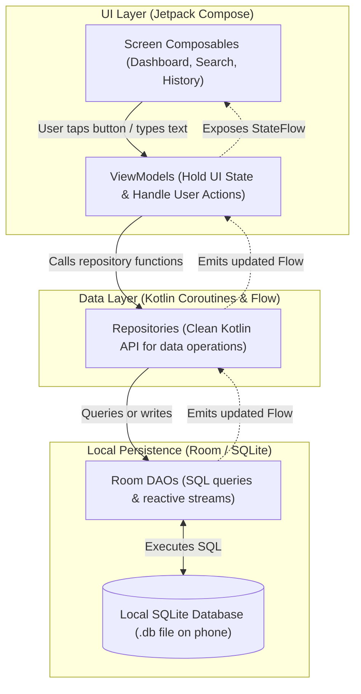

# CalorieTrack — Local-First Application Architecture

## 1. Architectural Philosophy: The "Boring & Reliable" Stack

For a non-technical founder building a lightweight, offline-first mobile app, the best architecture is the **simplest standard Android architecture**:
- **Zero unnecessary layers**: No complex domain interactors, no redundant DTO-to-entity mappers, and no complex reactive graphs.
- **Unidirectional Data Flow (UDF)**: Data flows up from the database to the screen; user events flow down from the screen to the database.
- **Single Source of Truth**: The local SQLite database is the only authority on what data exists. If it's in SQLite, the UI shows it.

---

## 2. High-Level Architecture Diagram

---

## 3. The 3 Architectural Layers Explained

### Layer 1: The UI Layer (Jetpack Compose)
- **Role**: Renders pixels on the screen and detects user interactions (taps, typing, scrolls).
- **Technology**: Jetpack Compose (Android's official declarative UI toolkit).
- **Key Principle**: Composables are "dumb". They do not execute SQL queries or calculate totals; they simply observe a `StateFlow` from the ViewModel and display whatever data it contains.

### Layer 2: State Management (ViewModel)
- **Role**: Survives screen rotations and phone configuration changes. Translates database models into clean UI state objects.
- **Technology**: AndroidX `ViewModel` + Kotlin `StateFlow`.
- **How It Works**:
  1. The ViewModel observes a continuous stream (`Flow`) of data from the Repository.
  2. When the user taps a button (e.g., "Add Food to Breakfast"), the ViewModel launches a lightweight background coroutine and tells the Repository to save the entry.
  3. The ViewModel never touches SQLite directly.

### Layer 3: The Data Layer (Repository + Room SQLite)
- **Role**: Manages all reading and writing to phone storage.
- **Technology**:
  - **Room**: Google's official object-relational mapping (ORM) library that sits on top of SQLite.
  - **SQLite**: The rock-solid, ultra-fast embedded database engine built into every Android phone since Android 1.0.

---

## 4. Room Components: Entities, DAOs, and Database

### 1. Entities (`@Entity`)
An Entity is a standard Kotlin data class that represents a single table in SQLite.
- Example: `FoodEntity` maps to a `foods` table where each row is a food item with columns for `id`, `name`, `calories_per_serving`, etc.

### 2. DAOs (`@Dao` - Data Access Objects)
A DAO is a Kotlin interface containing the SQL queries used to read and write data. Room automatically generates the underlying SQLite code at compile time.
- Read operations return a Kotlin `Flow<T>`, which automatically emits new data to the screen whenever the database changes.
- Write operations (`@Insert`, `@Update`, `@Delete`) are marked with `suspend` so they run safely on background worker threads without freezing the user interface.

### 3. The Database (`@Database`)
The main entry point that ties all entities and DAOs together. Room ensures that the database is opened efficiently as a singleton (only one connection open at a time to prevent memory leaks).

---

## 5. End-to-End Data Flow: An Everyday Example

Let's walk through what happens when a user logs an apple:

1. **User Action**: The user taps **"Log Apple"** on the Food Details screen.
2. **Event Dispatched**: The Compose screen calls `viewModel.logFood(foodId = 12, serving = 1.0, mealType = "LUNCH")`.
3. **Repository Call**: The ViewModel calls `mealRepository.addMealEntry(...)`.
4. **Database Write**: The Repository invokes `mealDao.insertMealEntry(...)`. Room inserts a new row into the SQLite `meal_entries` table on internal disk storage.
5. **Reactive Trigger**: Because `mealDao.getTodayMealEntries()` returns a reactive Kotlin `Flow`, Room notices that the table changed and immediately emits the updated list of foods.
6. **UI Update**: The ViewModel receives the new list, recalculates today's totals in memory, and updates its `StateFlow`.
7. **Screen Re-render**: The Jetpack Compose Dashboard observes the new state and smoothly updates the progress bar and calories consumed—with **zero manual refresh buttons needed**.

---

## 6. Why This Keeps the App Fast on 8 GB / Dual-Core Hardware
- **No Background Services**: The app only does work when the user is actively looking at it.
- **Zero Network Latency**: Because queries hit local flash storage via SQLite, local query operations are targeted to complete in **under 15 milliseconds**, compared to cloud APIs which typically take 500 to 3,000 milliseconds.
- **Minimal RAM Goal**: Room streams only the records needed for the active screen, with a performance target of keeping active memory consumption well below 50 MB.
