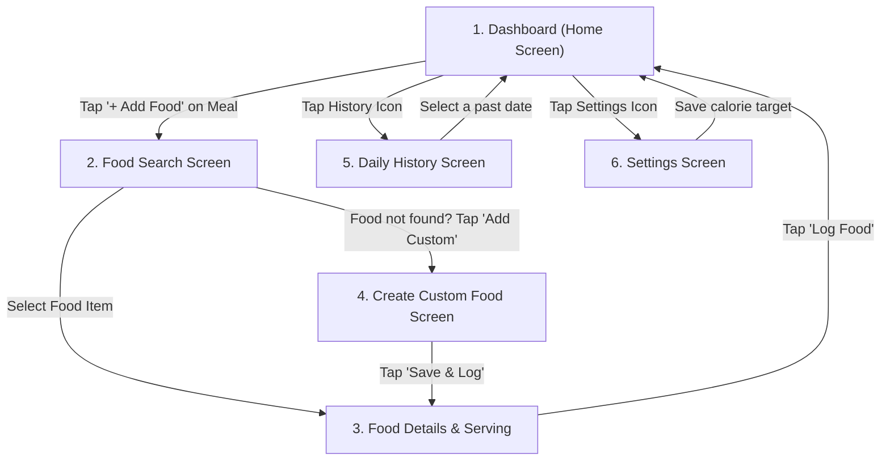

# CalorieTrack — Screen Architecture & Navigation Flows

This document details the user interface architecture for the initial release of CalorieTrack built with **Jetpack Compose** and **AndroidX Navigation**.

---

## 1. Screen Flow Diagram

---

## 2. Screen Specifications

### Screen 1: Dashboard (Home Screen)
- **Purpose**: The central landing hub showing today's progress and logged meals at a glance.
- **Important Elements**:
  - **Calorie Summary Card**: Circular or horizontal progress bar displaying:
    - Target Calories (e.g., 2,000 kcal)
    - Consumed Calories (e.g., 1,450 kcal)
    - Remaining Calories (e.g., 550 kcal)
  - **Macronutrient Progress Pills**: Quick indicators for Protein, Carbs, and Fat (consumed vs. goal).
  - **Date Header**: "Today, Sep 30" with arrows to navigate back/forward one day.
  - **Meal Cards (Breakfast, Lunch, Dinner, Snacks)**:
    - Subtotal calories for that meal.
    - List of logged foods with serving size and calories.
    - **"+ Add Food"** button on each meal card.
- **User Actions**:
  - Tapping **"+ Add Food"** on a meal opens **Food Search** pre-filtered for that meal category.
  - Tapping a logged food displays an option to delete or edit serving.
  - Tapping top bar icons opens **History** or **Settings**.

---

### Screen 2: Food Search Screen
- **Purpose**: Fast, distraction-free searching over the local food catalogue.
- **Important Elements**:
  - **Search Input Field**: Text bar with instant search-as-you-type and clear button (`X`).
  - **Results List**: Scrollable list of matched foods showing food name, standard serving size (e.g., "100g"), and calories per serving.
  - **"Food Not Found?" Banner**: A clean card at the bottom: *"Can't find your food? Tap here to add a custom food."*
  - **Selected Meal Indicator**: Small chip at top indicating target meal (e.g. "Adding to Lunch").
- **User Actions**:
  - Typing in the search bar updates results in real time.
  - Tapping any food row navigates to **Food Details & Serving**.
  - Tapping **"Add Custom Food"** navigates to **Create Custom Food**.
  - Tapping Back returns to **Dashboard**.

---

### Screen 3: Food Details & Serving Adjustment
- **Purpose**: Fine-tuning the exact amount eaten and previewing calculated nutrition before logging.
- **Important Elements**:
  - **Food Title & Category**: (e.g., "Brown Rice (Cooked)").
  - **Serving Quantity Input**: A clean number field with increment/decrement stepper buttons (`-` and `+`). Default is `1.0`.
  - **Unit Selector**: Shows the base unit (e.g., "100 grams", "1 cup", "1 slice").
  - **Dynamic Nutrition Breakdown**:
    - Large calorie number that scales live as the user changes quantity.
    - Breakdown cards for Protein, Carbohydrates, and Fat.
  - **Meal Type Dropdown**: Defaults to the meal clicked on Dashboard, but can be changed (e.g., Breakfast → Dinner).
  - **Primary Action Button**: Prominent button at the bottom: **"Log Food — [X] kcal"**.
- **User Actions**:
  - Entering numbers or tapping `+`/`-` updates calories and macros instantly.
  - Tapping **"Log Food"** commits the entry to Room SQLite and pops back to the **Dashboard**.

---

### Screen 4: Create Custom Food Screen
- **Purpose**: Allowing users to enter any food item not in the built-in catalogue.
- **Important Elements**:
  - **Food Name Field**: (e.g., "Grandma's Sourdough Bread").
  - **Serving Unit Field**: (e.g., "slice", "100g", "bowl").
  - **Nutrient Fields**:
    - Calories (Required)
    - Protein (Optional / default 0)
    - Carbs (Optional / default 0)
    - Fat (Optional / default 0)
  - **Save Button**: **"Save to My Foods"**.
- **User Actions**:
  - Filling the form and tapping Save stores the food into Room with `is_custom = 1`.
  - Automatically transitions to the **Food Details** screen so the user can immediately log it.

---

### Screen 5: Daily History Screen
- **Purpose**: Reviewing past dietary compliance and calorie trends over time.
- **Important Elements**:
  - **Date Selector**: Horizontal scrollable week strip or standard date picker.
  - **Historical Day Summary Card**: Total calories vs. goal for that selected date.
  - **Macro Breakdown**: Bar or pie chart representing the split between Protein, Carbs, and Fat for that day.
  - **Meal Breakdown**: Full list of what was eaten for Breakfast, Lunch, Dinner, and Snacks on that past date.
- **User Actions**:
  - Tapping any date in the past displays that day's complete record.
  - Tapping Back returns to today's **Dashboard**.

---

### Screen 6: Settings Screen
- **Purpose**: Minimal local settings for managing daily targets and app preferences.
- **Important Elements**:
  - **Daily Calorie Target Setting**: Quick editor to change the daily calorie goal (e.g., from 2,000 to 1,850 kcal).
  - **Optional Macro Goals**: Target sliders or number fields for daily Protein, Carbs, and Fat targets.
  - **App Information**: App version, open-source licenses, and offline privacy statement.
  - **Nutrition Disclaimer**: Friendly health disclaimer stating values are for reference only.
- **User Actions**:
  - Updating calorie target writes directly to the local `daily_goals` table.
  - Tapping Back returns to the **Dashboard** with the new calorie target immediately active.
