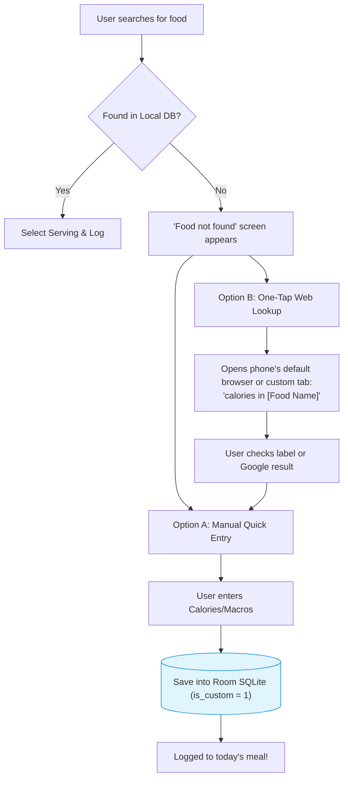

# CalorieTrack — Unknown Food Handling Strategy

This document defines how CalorieTrack handles foods that are not currently in the built-in offline catalogue, adhering strictly to a **zero-cost, zero-server architecture**.

---

## 1. The Core Challenge

No offline calorie tracker can bundle every branded food, restaurant item, or regional dish without becoming a multi-gigabyte download. When a user searches for an item not found in the local catalogue (e.g., *"Trader Joe's Almond Biscotti"* or a regional curry), the app must provide an immediate, frictionless fallback.

---

## 2. The 3-Step V1 Strategy: Search → Lookup → Save Locally



---

## 3. Detailed Component Breakdown

### Step 1: Smooth "Not Found" State
When a search query yields zero results:
- The app displays an encouraging, helpful card instead of a blank screen:
  > **"Can't find '[Search Query]'?"**
  > *Add it as a custom food in 10 seconds, or check online.*
- Two primary buttons are presented:
  1. **"Create Custom Food"** (Default, 100% offline).
  2. **"Search Web"** (Optional, uses the phone's browser).

### Step 2: Zero-Cost Web Lookup (Android Intent)
Mainstream apps use expensive commercial nutrition APIs ($200–$500/month) to fetch branded items. CalorieTrack achieves the same outcome with **zero API cost, zero servers, and zero API rate limits** using Android's native browser Intent:

```kotlin
// Zero-cost web lookup using Android standard Intent
val searchUrl = "https://www.google.com/search?q=" + Uri.encode("calories in $query")
val intent = Intent(Intent.ACTION_VIEW, Uri.parse(searchUrl))
context.startActivity(intent)
```

- **Why this is superior for V1**:
  1. **Cost**: **$0.00 forever**. No API keys to maintain or pay for.
  2. **Speed**: Opens in a split second via Chrome Custom Tabs or the phone's default browser.
  3. **Data Quality**: Google displays the official nutritional panel directly at the top of search results.
  4. **Privacy**: CalorieTrack never tracks the search or sends user identifiers; the phone's browser handles the lookup directly.

### Step 3: Fast Manual Entry & Automatic Local Caching
1. The user returns to CalorieTrack with the numbers from the browser or the physical food packaging.
2. The user fills in:
   - **Name**: Pre-filled with their search query (e.g., *"Almond Biscotti"*).
   - **Serving Unit**: (e.g., *"1 cookie (30g)"*).
   - **Calories**: (e.g., `140`).
   - **Macros (Optional)**: Protein `3g`, Carbs `18g`, Fat `6g`.
3. Tapping **"Save & Log"**:
   - Saves the item permanently into the local SQLite `foods` table with `is_custom = 1`.
   - Immediately adds the item to today's meal log.

---

## 4. The Compound Benefit: The Catalogue Grows With the User

Because every custom food is permanently saved to the phone's local SQLite database:
- **Next Time Search**: If the user eats that same food tomorrow or next week, typing the name in the search bar **instantly finds it locally** in milliseconds.
- **100% Offline Resilience**: Once saved, the user can log that custom food on airplanes, hiking trails, or anywhere without cell reception.
- Over time, the user organically builds a hyper-personalized, ultra-fast personal food catalogue tailored exactly to the foods they actually buy and eat.
